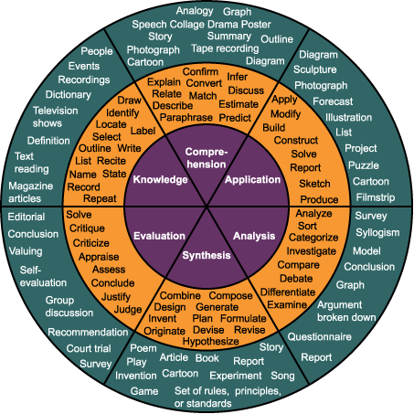
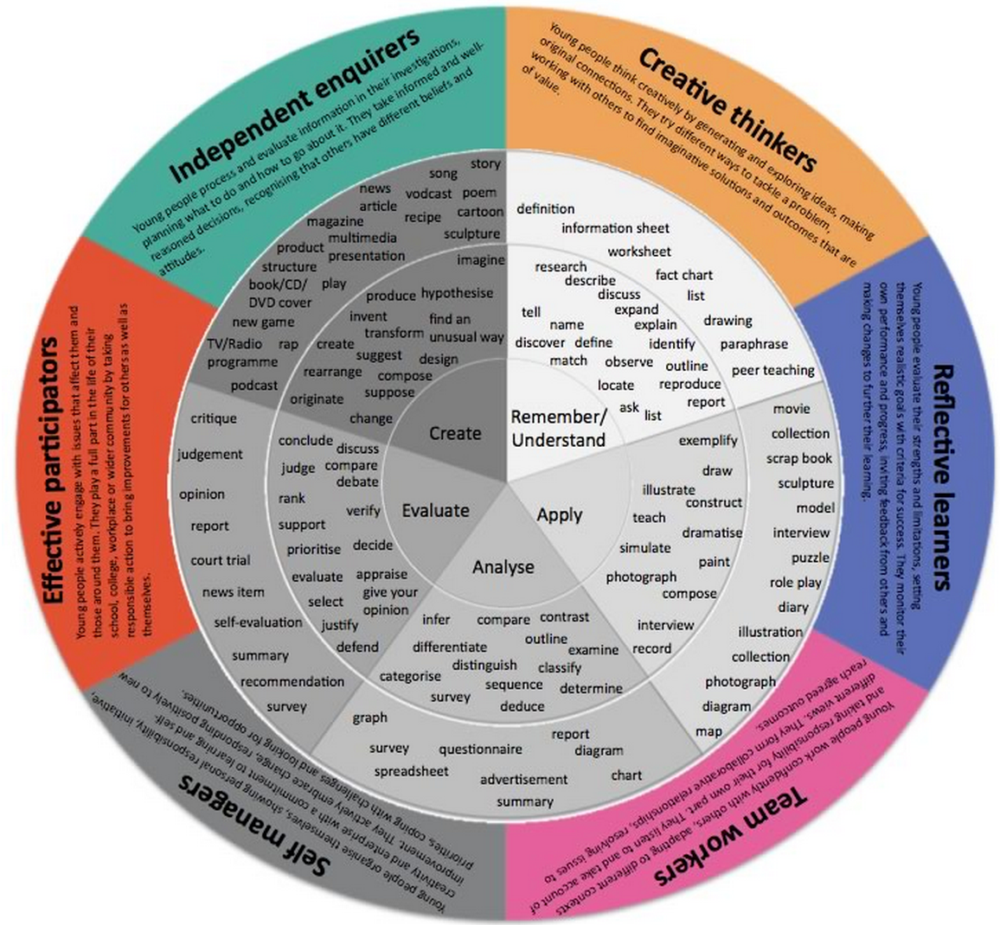
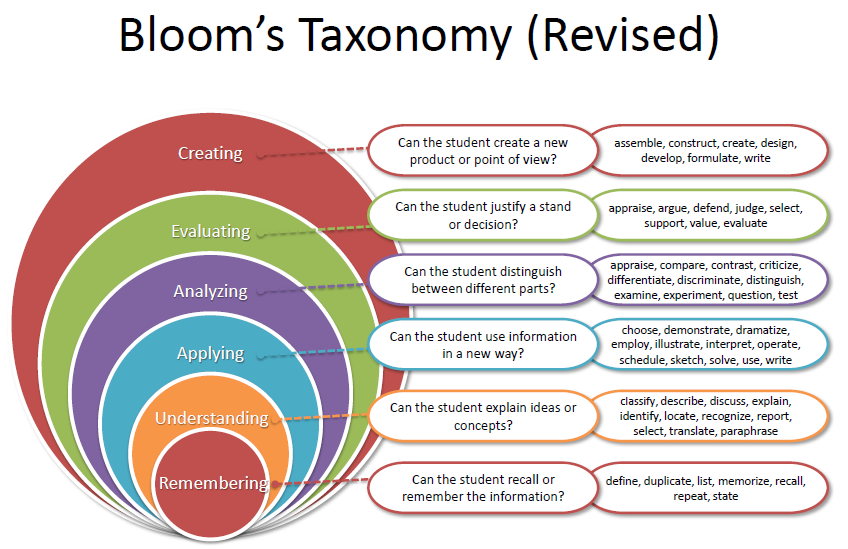
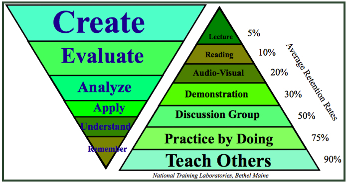

# Timeline for a Talk

@emmajanehw

[www.trainingintheopen.com](http://trainingintheopen.com)

[www.gitforteams.com](http://gitforteams.com)

# Background

- Nearly 30 years experience giving presentations.
- Over 100 conference sessions delivered.
- Three books written (Drupal and Git).
- This talk is 100% opinion. (Dis)agreements welcome!

# Agenda

- The Phases: (rant), Brainstorming, Draft, Polish
- Preparation: Preconference, Day before, Night before, Morning of ...

## Brainstorming Phase

(warning: this section is mostly a rant about doing outcome-driven presentations)

## Brainstorming Overview

- Record learning outcomes for the session.
- Set agenda for the topics with the key ideas.
- Write the session description based on work to date.
- Write a blog post; or series of blog posts about your talk.

### Learning Outcomes == Test Driven Development 

(sort of)

### Sample Learning Outcome

By the end of this session, attendees will be able to:

use Bloom's Taxonomy

to create testable learning outcomes for their conference sessions.

### Working Backwards from My Outcome...

- My presentation must include an overview of Bloom's Taxonomy.
- I need to provide examples of good, and bad learning outcomes.
- I should test my audience to ensure they have achieved the desired outcome.

## Sort Of

We're actually doing cheater learning outcomes because I'm not specifying the accuracy or the precision of the outcome when tested. They're more like a user story / learning outcome hybrid.

## Bloom's Taxonomy

## It's Not Always the Same

## And It's Been Updated 

## There Are Also Made-Up Facts About Bloom's Taxonomy

## Example of a Bad Learning Outcome

By the end of this session, attendees will know Bloom's Taxonomy.

## Can You Fix The Example Below?

By the end of this session, attendees will know Bloom's Taxonomy.

# &lt;/rant>

## Draft Phase

- Write the first draft of your slides, incorporating comments from the blog posts you've written.

## Polish Phase

- Start saying your talk out loud.
- Fix the slides to match your story, adding imagery where relevant.
- Decrease the amount of text on each slide.
- Add resources / reference links.

### Accessibility Checklist

- Colours: colour blindness, contrast.
- Size: Ensure all text is no smaller than 1/10 the height of the slide.
- Motion: Remove unnecessary animations.
- Humour: We are an international conference with a code of conduct. Give respect.

## Practice Phase

- Screen cast your practice sessions.
- Record any "live" demos.
- Double check the session description.
- Pack your day bag for your presentation and make sure everything fits!

## Preconference Phase

- Do one more full run of your presentation.
- Remind your supporters of the time / room for your presentation.
- Simplify your speaker notes.
- Optional: print your speaker notes for easy review.
- Get a good night's sleep.

## Phases: In Summary

- Preparing for your talk can begin months in advance.
- Design useful outcomes for your attendees.
- Focus your presentation by testing the ideas in various formats.
- Use blogging as preparation for your talk.
- Pratice saying the words out loud (to yourself, and/or others).

# Final Preparations

(This assumes a multi-day conference. Your time line may vary.)

## Day Before

- Go to the room where you'll be presenting.
- Introduce yourself to the AV team if they are around.
- If possible, do a tech check in your room.
- Make sure the room # is the same on all versions of the schedule.
- Drink lots of water and make sure you are hydrated.
- Upload your slides.
- If you're an introvert, get as much quiet time as you can during the day to ensure you're fully charged for tomorrow.

## Night Before

Pack your bag for tomorrow and include:

- Fully charged laptop.
- Power cable for your laptop + power adaptor if you are not in your home country.
- Presentation on USB as PDF in case your laptop dies.
- Printed speaker notes.
- Water bottle (filled).
- VGA display converter thingy (for the projector).
- Remote control (if you have one).
- Clean shirt and trousers (for those of us who are prone to spilling coffee down our fronts)

### You probably won't sleep tonight. Don't stress about that. Do the best you can to relax.

## Morning Of

- Try to eat breakfast. Being stressed out takes calories.
- Hydrate with water, or fruit juice. A dry throat goes hoarse quickly.
- Check in with the conference organisers so they know you are on-site and ready to present.
- Smile lots. It may trick your body into thinking this is fun.

## Half an Hour Before

- Final pee!
- If the presentation ahead of you is still going, either wait outside the room, or sneak into the back quietly.

## (Literally) The Last Few Minutes

- As soon as you can, get onto the stage.
- Get your laptop plugged in and working with the projector.
- Get help putting your mic on if it's a clip mic.
- Navigate to your first slide, and start the presentation.
- More smiling!

## During the Presentation

Let people know at the beginning of the presentation when you would like to field their questions.

- At the end of the presentation. Best for new speakers.
- During the presentation at specific points. Great if you're running fast.
- During the presentation at any time. Caution: don't get derailed!

## More Tips on Audience Management

[trainingintheopen.com/audience-management.html](http://trainingintheopen.com/audience-management.html)

# In Summary

- Start with the audience in mind. Have empathy, and aim for outcomes.
- Leave yourself enough time to refine your thinking about the topic.
- Do more writing and brainstorming before you start your slides.
- Get feedback early in the process so that you can address common misconceptions / misunderstandings in your presentation.
- Leading into the conference itself: you're going to be nervous. Embrace this and control what you can control.
- The stage is yours. Get to know it, befriend it, and then own it.

# Resources

Twitter: @emmajanehw

Resource: [trainingintheopen.com/speakers-checklist.html](http://trainingintheopen.com/speakers-checklist.html)

Slides: [emmajane.github.io/speaker-training](http://emmajane.github.io/speaker-training)
